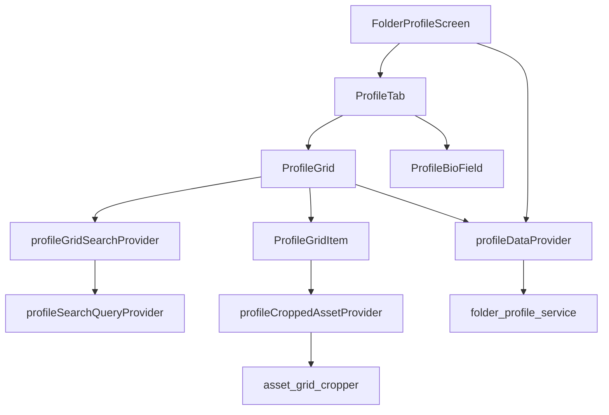

# Folder Profile Profile Tab — Implementation Architecture

`lib/features/folder_profile/profile/` hosts the **Profile** sub-tab inside `FolderProfileScreen`. It is a thin, read-heavy face on the same aggregate that gallery, posts, and reels use: **folder metadata**, **grid placeholders or a full grid**, **search**, and **multi-select** with bulk actions delegated upward through callbacks.

The library is intentionally split so UI composition, grid layout, the 3×3 cropping pipeline, and windowed row generation live in separate files. Data loading and mutation remain in `folder_profile_screen.dart` and `folder_profile_service.dart`; this folder should not grow another repository layer.

---

## Physical map

```
profile/
  profile_tab.dart          # Stateless shell: header, counters, grid OR placeholders
  profile_grid.dart       # Sliver layout, visibility gates, profile search, selection chrome
  profile_grid_item.dart    # Layout delegates (uniform vs cropped square)
  asset_grid_cropper.dart   # load → center-square crop → provider cache
  profile_grid_provider.dart  # Riverpod lifecycle, paging merge, crop queue, disk eviction
  ARCHITECTURE.md           # This document
```

Parent wiring (`FolderProfileScreen`): `profile_tab.dart` imports `../../folder_profile_screen.dart` for `profileTabIndex` and imports `../tabs/tab_components.dart` for the Bio field—tight coupling to the tab index constant is intentional.

---

## Role in the folder profile feature

`FolderProfileScreen` keeps tab index, loads `profileDataProvider(folderPath)` (blocking + paginated), holds `selectedItems` / `isSelectionMode`, and passes **callbacks only** into Profile. Profile does not call `folderProfileService` directly.

| Concern | Owner | Profile tab |
|--------|--------|-------------|
| Folder aggregate | `profileDataProvider` | `ref.watch` only |
| Full grid media | Same provider + gallery slice | `effectiveProfileGridItems` |
| Cropped thumbnails | `profileCroppedAssetProvider` per URI | Indirect via `ProfileGridItem` |
| Search query | `profileSearchQueryProvider` | Typing + clear via grid search bar |
| Search results | `profileGridSearchProvider` | Supersedes normal grid when non-empty |
| Selection set | Parent `Set<int>` | Tap / long-press / counters |
| Bulk actions | Parent handlers | Toolbar when `isSelectionMode` |
| Bio save | `onSaveBio` → screen | `ProfileBioField` in header |



---

## Data shapes the tab consumes

From `ProfileData` (`profile_data_provider.dart`):

| Field / getter | Used for |
|----------------|----------|
| `folder`, `profileUrl` | Header avatar, name |
| `isLoading`, `error` | Center spinner vs error `EmptyState` |
| `itemCount` | Posts counter (total in folder) |
| `visibleItemCount` | Gallery sub-tab label when paginated |
| `gridItems` | First page / placeholder URIs from blocking load |
| `effectiveProfileGridItems` | `paginatedGridSlice ?? gridItems` — **source of truth for grid rows** |
| `reels`, reel counters | Profile counters (`reelsCount`); reels tab uses full list |
| `paginatedItems`, flags | When parent switches grid from placeholders to full list |

**Placeholders vs full grid:** `ProfileTab` sets `gridThumbnailUrls` from `effectiveProfileGridItems`, then `usePlaceholders = gridThumbnailUrls.length <= 9 && _profileData.isLoading`. While true, `ProfileGrid` shows skeleton slots; when the list grows or loading ends, real tiles and `(+N)` overflow appear. Layout mode is **locked** on first paint via `initialLayoutModeProvider` so a late placeholder→real swap does not flip uniform ↔ cropped mid-session.

Search path: non-empty `profileSearchQueryProvider` → `profileGridSearchProvider` → `searchMatches` in `ProfileGrid`; grid defers to `searchMatches ?? effectiveProfileGridItems` for building rows.

---

## File responsibilities

| File | Responsibility |
|------|------------------|
| `profile_tab.dart` | `ProfileTab`: `ProfileHeader`, optional `ProfileFollowStatsGrid`, `ProfileBioField`, `ProfileGrid` or `ProfileActionButtons` |
| `profile_grid.dart` | `ProfileGrid`, `SearchBarDelegate` (sliver search + selection toolbar), cropped block builder, staggered uniform rows, `+N` tile |
| `profile_grid_item.dart` | `ProfileGridItem`, `UniformProfileLayoutDelegate`, `CroppedSquareProfileLayoutDelegate` |
| `asset_grid_cropper.dart` | Filesystem load, optional `AssetEntity` path, center crop to square file under cache dir |
| `profile_grid_provider.dart` | `ProfileGridLayoutMode`, crop/inflight/disk maps, displayed rows, visible preload + eviction |

`tabs/tab_components.dart` (parent `tabs/`) supplies shared chrome: `ProfileHeader`, counters, bio, placeholders—not duplicated under `profile/`.

---

## Profile tab shell (`profile_tab.dart`)

Stateless widget; all mutable state is upstream.

1. **`ref.watch(profileDataProvider(folderPath))`** — single subscription for the tab body.
2. **Empty / loading branch** — no `folder` and (`isLoading` or `error`): centered `CircularProgressIndicator` or `EmptyState` using `context.l10n` (`folderNoMedia`, `folderProfileErrorLoadFolder`).
3. **Loaded branch** — `CustomScrollView` + `SliverToBoxAdapter` (header block) + `SearchBarDelegate` + grid sliver **or** action buttons.

**Other-account affordances** (`isUserProfile && !isOwnProfile`): stats grid with `onItemTap` drilling into gallery via `onTabRequested?.call(galleryTabIndex)`. Layout mode and selection are hidden when `!isOwnProfile && isUserProfile`.

Search is **not** a second AppBar: `SearchBarDelegate` is a `SliverPersistentHeader` (pinned) so the field stays visible while scrolling the grid.

When `isSelectionMode`, `ProfileActionButtons` replace the grid (`padding: 72` bottom); selection clearing stays on the parent.

---

## Grid layout and visibility (`profile_grid.dart`)

### Layout modes (`ProfileGridLayoutMode`)

| Mode | Visual | Implementation |
|------|--------|----------------|
| `uniform` | Fixed-height horizontal strips, 3 tiles per row, staggered row heights by `index % 3` | `StaggeredGrid` + `UniformProfileLayoutDelegate` |
| `cropped` | Instagram-style 3×3 macro-blocks | `buildCroppedGridBlock` + `CroppedSquareProfileLayoutDelegate` |

Toggle: `ToggleButtons` bound to `profileGridLayoutModeProvider` (`autoDispose.family` per `folderPath`). Only meaningful when `isOwnProfile || !isUserProfile`.

### Row count and overflow

- **Uniform:** `rowCount = (items.length / 3).ceil()`; last incomplete row still gets height from `calculateRowHeight(rowIndex)`.
- **Cropped:** `blockCount = (items.length / 9).ceil()`; each block is one `StaggeredGridTile` with internal 3×3 `StaggeredGrid`.
- **`+N` tile:** `extraGridItems = itemCount - gridThumbnailUrls.length` on the **last** row/block when `showOverflowIndicator` (pagination still catching up). Tap → `onTabRequested(galleryTabIndex)`; non-selectable (`IgnorePointer`).

### Selectability

`canSelectItems = (isOwnProfile \|\| !isUserProfile) && onLongPressItem != null`. Long-press enters selection; tap toggles when `isSelectionMode`. Search results use the same `itemBuilder` but overflow `+N` is suppressed when `searchMatches != null`.

### Cropped block geometry (summary)

`buildCroppedGridBlock` resolves `List<Widget>` from `displayedCroppedGridRowsProvider(folderPath)` (real tiles or grey placeholders), then lays out nine cells with variable spans—classic “one large + eight small” pattern. Details stay in source; delegates enforce square cells and selection overlays (`ColorScheme.primary` @ 0.45 when selected).

### Visibility-driven media work

`VisibilityDetector` on each **logical row key**:

- Cropped: `rowIndex` = macro-block index.
- Uniform: flat row index `blockIndex * 10 + rowIndex`.

On `visibleFraction > 0` → `setCroppedRowVisible(folderPath, rowIndex, true)` → `preloadCroppedRowImages`. On hide → `setCroppedRowVisible(..., false)` → eviction when the row is not in the active visible set (cropped mode only evicts provider cache for that path).

`effectiveRowCount` differs by mode (cropped ≈ `ceil(n/9)`, uniform ≈ `ceil(n/3)`), so visibility keys stay comparable within a mode.

---

## Cropping pipeline (`asset_grid_cropper.dart` + provider)

### Pipeline steps

1. **Cache file path** — `{cacheDir}/profile_crop_{sanitizedAssetId}.jpg` (non-alphanumeric → `_` in id segment).
2. **Disk hit** — if file exists, return path (logged at fine level).
3. **Load bytes** — `File(assetId)` on desktop/filesystem gallery; else `AssetEntity.fromId` + `thumbnailDataWithSize` (400 edge) or full-file path fallback.
4. **Center square** — `image` package: crop `min(w,h)` from image center; optional downscale so long edge ≤ 800px; encode JPEG quality 85 (or 75 if still > ~500KB).
5. **Write** atomically to cache path; return path for `Image.file`.

### Provider orchestration (`profile_cropped_asset_provider`)

| Map / set | Purpose |
|-----------|---------|
| `_inflight` | Dedupe concurrent crop per `assetId` |
| `_cache` | `assetId` → cropped file path (memory) |
| `_preloadQueued` | Avoid duplicate preload queue entries |
| `_visibleCroppedRows` | Row indices currently visible (per folder) |
| `_displayedCroppedGridRowsProvider` | Last built widget list per folder for placeholders |

**Preload:** `preloadCroppedRowImages` enqueues up to nine URIs per macro-block; processes via `_processPreloadQueue` with max **2** concurrent crops (`_maxConcurrentCrops`).

**Eviction:** when a row becomes invisible and is not in `_visibleCroppedRows`, `profileCroppedAssetProvider(uri)` is invalidated for each cell in that 3×3 block—bounded memory on long folders.

**Displayed rows notifier:** cropped blocks read cached widget lists so fast scroll shows grey placeholders until crops complete; revalidate when providers resolve.

---

## Riverpod surface (`profile_grid_provider.dart`)

| Symbol | Kind | Notes |
|--------|------|--------|
| `ProfileGridLayoutMode` | enum | `uniform`, `cropped` |
| `profileGridLayoutModeProvider` | `StateProvider.autoDispose.family` | Per `folderPath`; UI toggle |
| `initialLayoutModeProvider` | `StateProvider.autoDispose.family` | First non-empty grid snapshot; avoids layout flip |
| `profileCroppedAssetProvider` | `FutureProvider.autoDispose.family<String?, String>` | URI → cropped path |
| `displayedCroppedGridRowsProvider` | `StateProvider.autoDispose.family` | `List<List<Widget>>` for blocks |

**Not in this folder but required for Profile:**

| Symbol | Role |
|--------|------|
| `profileDataProvider` | `ProfileData` aggregate |
| `profileSearchQueryProvider` | Debounced-style query holder (family) |
| `profileGridSearchProvider` | Async search over folder index |

---

## Integration checklist (parent screen)

When extending Profile, keep this contract:

1. Pass **`gridThumbnailUrls`** derived from **`effectiveProfileGridItems`**, not a stale copy.
2. Pass **`itemCount`** from aggregate `itemCount` for counters and `+N`.
3. Wire **`onTabRequested`** for gallery drill-down and overflow tile.
4. Keep **`selectedItems`** and **`isSelectionMode`** in the screen; Profile only mutates via callbacks.
5. **`onSaveBio`**, **`onMediaLongPress`**, bulk handlers remain screen/service responsibilities.

```text
ProfileTab props (selected)
───────────────────────────
folderPath, isUserProfile, isOwnProfile
gridThumbnailUrls, itemCount, reelsCount
postCountSource, isShowingPlaceholders, isLoading
selectedItems, isSelectionMode
onTabRequested, onItemTap, onMediaLongPress, onClearSelection
onSaveBio, onAddContent, onEditProfile
onMoveToTrash, onCreateAlbumAndMove, onMoveItems, onOpenSettings
```

---

## Performance and UX constraints

- Cropped mode is heavier (decode + crop + disk); preload is **row-scoped** and **concurrency-limited**.
- Uniform mode still uses `VisibilityDetector` for consistent preload/eviction hooks where cropped rows are not used.
- Placeholder grid avoids layout jump by fixing `initialLayoutModeProvider` before real thumbnails arrive.
- Search replaces the item list without a separate route; overflow `+N` hidden in search results to avoid ambiguous navigation targets.

---

## Related code (outside `profile/`)

| Path | Relevance |
|------|-----------|
| `../folder_profile_screen.dart` | Tab host, selection, bio persistence, bulk actions |
| `../folder_profile_service.dart` | Load, mutate, search backing store |
| `../providers/profile_data_provider.dart` | `ProfileData`, pagination merge |
| `../providers/profile_search_provider.dart` | Grid search async provider |
| `../tabs/tab_components.dart` | Header, stats, bio, placeholders |
| `../tabs/gallery_tab.dart`, `posts_tab.dart`, `reels_tab.dart` | Sibling tabs sharing counters and `profileDataProvider` |

---

## Design intent (maintainer note)

Profile tab code should stay **presentational**: watch providers, render slivers, forward gestures. Any new capability that touches the media index (delete, move, reindex) belongs in the screen/service layer; any new grid visual belongs here or in `tab_components.dart` if shared across tabs.

When adding a third layout mode, extend `ProfileGridLayoutMode`, branch in `ProfileGrid.build`, add a delegate in `profile_grid_item.dart`, and decide whether visibility/preload keys remain per-row or need a new granularity—cropped mode’s nine-cell blocks are the precedent for amortizing expensive work.
